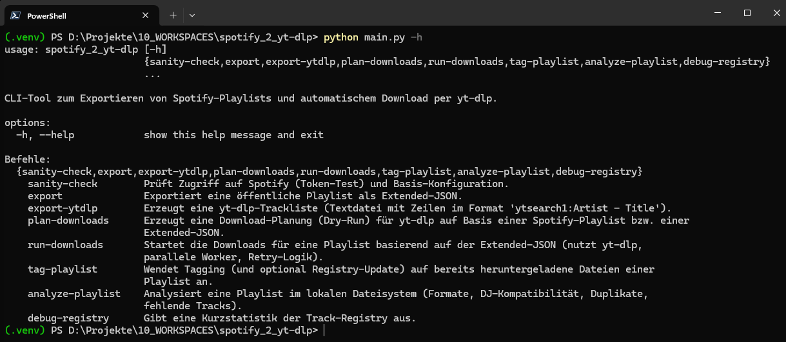
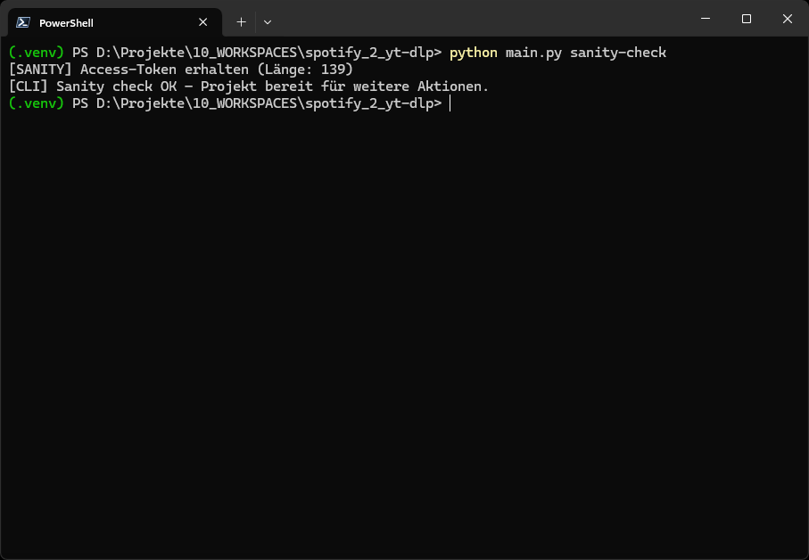
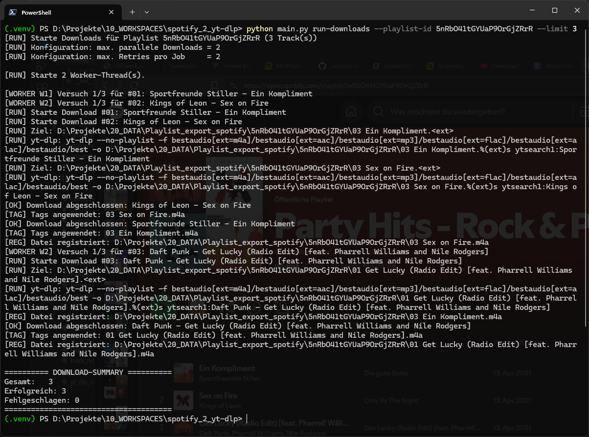
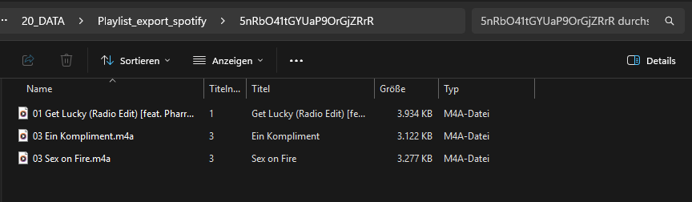

# TrackBridge – Playlist2Audio Engine

TrackBridge ist ein leistungsstarkes, professionelles CLI‑Tool zum Exportieren, Analysieren, Herunterladen, Taggen und Verwalten von Spotify‑Playlisten – optimiert für DJs, Content‑Creator, Archivare, KI‑Automations‑Workflows und alle, die saubere Audio‑Libraries lieben.

Der Kern von TrackBridge:
**Spotify‑Playlist rein → DJ‑taugliche, sauber getaggte Audiodateien raus.**

### Hinweis an die macOS- & Linux-Community

TrackBridge läuft vollständig unter macOS und Linux. Falls ihr euch zusätzlich eine **Easy-to-Use-Version** (ähnlich zum Windows-Easy-Guide) wünscht, meldet euch gerne über GitHub Issues.

Euer Feedback entscheidet, ob wir dafür eine eigene Plattform-Variante erstellen.

---

## 🚀 Features

### 🎧 Playlist‑Export

* Exportiert Spotify‑Playlisten als Extended‑JSON.
* Optionaler Export einer yt‑dlp Suchliste.
* Enthält alle Metadaten für Download, Tagging & Registry.

### ⬇️ Download‑Pipeline

* Automatischer Download‑Plan.
* yt‑dlp Integration mit Format‑Priorisierung.
* Parallele Worker + Retry‑Mechanik.
* Saubere Ordnerstruktur pro Playlist.

### 🏷 Präzises Tagging

* Mutagen‑Engine (MP3, M4A/MP4, AIFF).
* Setzt: Titel, Artist, Album, Tracknummer, BPM, Key.
* Covers möglich.
* DJ‑kompatibel (Rekordbox, Serato, Traktor, Engine DJ).

### 📚 SQLite‑Registry (optional)

* Speichert Track‑ID, Künstler, Pfad, Größe, Hash, Timestamp.
* Optional Speicherung der Spotify‑URL (nur DB, nie Audiofile).

### 🔁 Retag‑Pipeline

* Nachträgliches Tagging vorhandener Dateien.
* Keine Downloads nötig.

### 🔍 Playlist‑Analyse

* Format‑Check, DJ‑Kompatibilität, Duplicate‑Scan.

---

## 🧬 Architektur & Module

```text
main.py               → CLI / Subcommands
spotify_client.py     → API Zugriff
playlist_exporter.py  → JSON Export
yt_dlp_runner.py      → Downloads & Worker
tagging.py            → Mutagen Tagging
track_registry.py     → SQLite Registry
format_profiles.py    → DJ‑Profile
config.py             → Config / Validation
collection_analyzer.py→ Analyse‑Tools
```

---

## 📦 Installation

> 💡 Ausführliche Schritt-für-Schritt-Anleitungen findest du hier:
>
> * [INSTALL_EASY_WINDOWS.md](docs/INSTALL_EASY_WINDOWS.md) – für Windows-Nutzer ohne tiefere CLI-Erfahrung
> * [INSTALL_PRO_CROSSPLATFORM.md](docs/INSTALL_PRO_CROSSPLATFORM.md) – kompakter Guide für Power-User (Windows/macOS/Linux)

### Welche Anleitung ist für dich?

* **Windows Easy Guide:**
  Für alle Nutzer, die eine einfache, bebilderte oder Schritt-für-Schritt-Erklärung bevorzugen.

* **PRO Crossplatform Guide:**
  Für erfahrene Anwender, die schnell installieren möchten und mit Terminal/CLI sicher umgehen können.

Beide Anleitungen findest du hier:

* 👉 [INSTALL_EASY_WINDOWS.md](docs/INSTALL_EASY_WINDOWS.md)
* 👉 [INSTALL_PRO_CROSSPLATFORM.md](docs/INSTALL_PRO_CROSSPLATFORM.md)

### Spotify Developer App einrichten

1. [https://developer.spotify.com/dashboard](https://developer.spotify.com/dashboard)
2. App erstellen
3. Redirect‑URL: [http://localhost/](http://localhost/)
4. Client‑ID & Secret kopieren
5. In `.env` oder `config.json` eintragen

### Option A – `.env`

```text
SpotifyClientId=DEINE-ID
SpotifyClientSecret=DEIN-SECRET
```

### Option B – `config.json`

```json
{
  "SpotifyClientId": "<ID>",
  "SpotifyClientSecret": "<SECRET>"
}
```

### TrackBridge installieren

```bash
git clone https://github.com/carxonic-dev/TrackBridge.git
cd TrackBridge
python -m venv .venv
.\.venv\Scripts\Activate.ps1
# Falls blockiert:
Set-ExecutionPolicy -Scope Process -ExecutionPolicy Bypass
pip install -r requirements.txt
```

---

## ⚙ Konfiguration (config.json)

```json
{
  "OutputDirectory": "~/Music/TrackBridge",
  "MaxParallelDownloads": 2,
  "DownloadMaxRetries": 2,
  "SkipExistingFiles": true,
  "RegistryEnabled": true,
  "RegistryStoreSpotifyUrl": true,
  "AudioPreferredFormats": ["m4a", "aac", "mp3", "flac", "alac"],
  "DJCompatibilityProfile": "cdj_default",
  "DJWarnOnIncompatible": true
}
```

---

---

## 🧰 CLI-Kommandos

### 🔧 **Grundlegende Befehle**

```bash
# sanity-check: Prüft die Verbindung, Config und Grundfunktion
python main.py sanity-check

# export: Playlist aus Spotify lesen und als JSON/Registry ablegen
python main.py export --playlist-id <ID> --limit 50

# export-ytdlp: Playlist als yt-dlp-kompatible JSON-Datei exportieren
python main.py export-ytdlp --playlist-id <ID>
```

### ⬇️ **Download-Workflow**

```bash
# plan-downloads: Download-Plan für eine Playlist erstellen (Registry)
python main.py plan-downloads --playlist-id <ID> --limit 10

# run-downloads: Geplante Downloads ausführen
python main.py run-downloads --playlist-id <ID> --limit 20
```

### 🔍 **Analyse & Metadaten**

```bash
# tag-playlist: Metadaten (Artist, Title, Cover, etc.) anhand Registry setzen
python main.py tag-playlist --playlist-id <ID> --limit 10

# analyze-playlist: Übersicht / Analyse der Playlist erzeugen
python main.py analyze-playlist --playlist-id <ID>
```

### 🛠 **Debugging & Tools**

```bash
# debug-registry: Registry/JSON prüfen, Probleme sichtbar machen
python main.py debug-registry
```

---

## 📷 Screenshots

### CLI‑Übersicht



---

### Sanity‑Check



---

### Download‑Run



---

### Output‑Ordner



---

## 🧪 Typischer Workflow

```bash
python main.py sanity-check
python main.py export --playlist-id <ID>
python main.py run-downloads --playlist-id <ID>
python main.py tag-playlist --playlist-id <ID>
```

---

## 🤖 Zukunft & MusicVault‑Integration

TrackBridge wird langfristig eng mit **MusicVault** verzahnt:

* automatische Library‑Übernahme
* Duplicate‑Erkennung
* GUI / Web‑UI
* Multi‑User Profile
* Reencode‑Engine

---

## 🧾 Versionierung & Releases

TrackBridge folgt einem klar definierten Release-Tag-Konzept (`vMAJOR.MINOR.PATCH`).

* Details zur Versionierung und zu offiziellen Releases findest du hier:
  👉 [docs/RELEASE_TAGS.md](docs/RELEASE_TAGS.md)

---

## ☕ Support

Wenn dir TrackBridge oder eines meiner anderen Open-Source-Projekte weiterhilft, kannst du meine Arbeit hier unterstützen:

[](https://buymeacoffee.com/carxonicdev)

---

## 📄 Lizenz

MIT License – freie Nutzung für private & kommerzielle Projekte.

---

## ❤️ Credits

Developed by **carxonic-dev**, mit Fokus auf DJ‑Kompatibilität, saubere Metadaten, stabile Workflows & moderne Python‑Architektur.

---

### 📌 README Meta

* Version: 1.1.0
* Stand: 29-11-2025
* Release-Konzept & Changelog: siehe [docs/RELEASE_TAGS.md](docs/RELEASE_TAGS.md)
